# FIAP - Faculdade de Informática e Administração Paulista

<p align="center">
<a href= "https://www.fiap.com.br/"></a>
</p>

<br>

# **ENTERPRISE CHALLENGE - SPRINT 4 YOUVISA**

## GRUPO 4

## 👨‍🎓 Integrantes:
- <a href= "https://www.linkedin.com/in/amanda-fragnan-b61537255">Amanda Fragnan</a>
- <a href="https://www.linkedin.com/in/iolanda-helena-fabbrini-manzali-de-oliveira-14ab8ab0">Iolanda Manzali</a>
- <a href="https://www.linkedin.com/in/jonatasgomes">Jônatas Gomes Alves</a>
- <a href="https://www.linkedin.com/company/inova-fusca">Murilo Carone Nasser</a>
- <a href="https://www.linkedin.com/in/pedro-eduardo-soares-de-sousa-439552309">Pedro Eduardo Soares de Sousa</a>

## 👩‍🏫 Professores:
### Tutor(a)
- <a href="https://www.linkedin.com/in/leonardoorabona">Leonardo Ruiz Orabona</a>
### Coordenador(a)
- <a href="https://www.linkedin.com/company/inova-fusca">Andre Godoi Chaviato</a>

## **🌎 SOBRE O PROJETO**

O **PROJETO SPRINT 4 YOUVISA** consolida toda a evolução das sprints anteriores em uma **plataforma de atendimento inteligente** orientada a agentes. A solução conecta automação, comunicação com o usuário, processamento de linguagem natural e governança de IA em um fluxo unificado, permitindo que diferentes módulos do sistema atuem de forma coordenada para receber documentos, interpretar perguntas, registrar interações e acompanhar o ciclo de vida de cada processo de visto.

Nesta etapa, o chatbot deixa de ser um componente isolado e se torna o **ponto central de orquestração multiagente**: um agente classificador identifica a intenção do usuário (Intent Classification + extração de entidades), um agente de contexto consulta o banco de dados via APIs internas e um agente generativo (Gemini) produz a resposta sob *guardrails* rígidos. Todas as interações são registradas em logs estruturados, permitindo rastreabilidade e auditoria do atendimento.

---

## 🧠 **FLUXO DE ATENDIMENTO AUTOMATIZADO (SPRINT 4)**

O atendimento foi modelado como um **pipeline de agentes inteligentes** acionado tanto pelo chatbot do site (`/chatbot`) quanto pelo bot do Telegram. Cada mensagem do usuário percorre as seguintes etapas:

### 1. Recepção e Pré-processamento (Input Guardrails)
- Entrada recebida no `services_chatbot.py` (web) ou `telegram_bot.py` (Telegram).
- Filtragem de entrada e sanitização contra **Prompt Injection** (delimitação de escopo, remoção de instruções suspeitas, limites de tamanho).
- Identificação da sessão (`session_id`) e, quando aplicável, do usuário autenticado via JWT.

### 2. Agente de Classificação de Intenção (NLP)
- Aplica **Intent Classification** sobre a mensagem para enquadrá-la em categorias como: `pergunta_geral`, `status_processo`, `documentos_pendentes`, `proximo_passo`, `analise_caso`, `solicitacao_alteracao`, `human_handoff`.
- Extrai entidades relevantes (tipo de visto, país, número de processo, tipo de documento).
- Implementado com prompt engineering estruturado sobre o **Google Gemini**, com exemplos guiados (few-shot) que limitam o conjunto de saídas possíveis.

### 3. Agente de Autenticação Condicional
- Se a intenção exige dados privados (status, documentos, alteração), o agente força o fluxo de **login OTP** dentro da própria conversa (mesmo fluxo do site).
- Para perguntas gerais, o usuário segue sem autenticação.

### 4. Agente de Contexto (RAG conceitual)
- Consulta APIs internas do FastAPI (`services.py`, `services_copilot.py`) para recuperar dados estruturados: processos do usuário, status atual, transições, documentos enviados, requisitos do visto, relatório de prontidão.
- Os dados retornados são injetados no prompt como **contexto controlado**, garantindo que o modelo responda apenas com base em fatos do banco.

### 5. Agente Generativo (Resposta com Guardrails)
- O Gemini recebe um prompt estruturado contendo: persona, regras de negócio, escopo permitido, contexto do usuário e a pergunta.
- **Guardrails aplicados**: a IA não infere prazos, não toma decisões consulares, não promete aprovações e traduz estados técnicos em linguagem acessível.
- Para intenções de alteração de dados, a IA orienta o usuário a usar o dashboard, sem executar mutações diretas.

### 6. Registro Estruturado da Interação
- Cada turno (pergunta + resposta + intenção + entidades + `session_id` + timestamp + usuário) é persistido em tabela dedicada de logs no Oracle.
- Esses registros alimentam o histórico de atendimento, métricas de governança e auditoria de IA.

### 7. Notificações e Handoff
- Eventos relevantes (mudança de status, prontidão < 70, solicitação de humano) disparam notificações **dual-channel** (e-mail HTML + Telegram) via `event_bus.py`.
- Em caso de *human handoff*, o atendimento é transferido bidirecionalmente entre o admin (dashboard) e o usuário (Telegram/web).

---

## 🧩 **ORGANIZAÇÃO DOS COMPONENTES DO SISTEMA**

A plataforma adota uma **arquitetura modular baseada em serviços**, com separação clara entre apresentação, orquestração de agentes, regras de negócio, integração com IA e persistência.

```
youvisa-sprint3/
├── frontend/                  → Next.js 15 (App Router) + React 19 + Tailwind v4
│   ├── app/                   → Rotas (home, /sobre, /servicos, /dashboard, /admin, /chatbot)
│   ├── components/            → Navbar, Timeline, ChatWidget, Modais, Cards
│   ├── hooks/                 → Hooks de auth, fetch, sessão de chat
│   └── lib/                   → Cliente de API, helpers de JWT, utils
│
├── backend/                   → FastAPI + oracledb (SQL puro, sem ORM)
│   ├── main.py                → Bootstrap FastAPI, CORS, roteamento
│   ├── config.py              → Carregamento de .env (JWT, Gemini, AWS, SMTP, Telegram)
│   ├── database.py            → Pool oracledb + DictCursor (tradução PostgreSQL→Oracle)
│   ├── auth.py                → OTP por e-mail, emissão/validação de JWT
│   ├── services.py            → CRUD de processos, documentos, transições, requisitos
│   ├── services_ai.py         → Integrações AWS Textract (OCR) e Rekognition (face match)
│   ├── services_chatbot.py    → Orquestração multiagente (intent → contexto → resposta)
│   ├── services_copilot.py    → Copiloto de Prontidão (Gemini com function calling)
│   ├── services_telegram.py   → Vinculação, mensagens e uploads via Telegram
│   ├── telegram_bot.py        → Worker do bot Telegram (long polling)
│   ├── telegram_templates.py  → Templates de mensagens push
│   ├── event_bus.py           → Pub/Sub interno: dispara e-mails e Telegram em mudanças
│   └── uploads/               → Armazenamento local de documentos
│
└── CLAUDE.md / SPRINT_4.md    → Contexto e requisitos da sprint
```

### Camadas lógicas
- **Camada de Apresentação (frontend):** UCD (User-Centered Design) — dashboard com timeline do processo, histórico de interações, chatbot embutido e área administrativa.
- **Camada de API (FastAPI):** endpoints REST que expõem processos, documentos, autenticação e o pipeline do chatbot.
- **Camada de Orquestração de Agentes:** `services_chatbot.py` e `services_copilot.py` coordenam os agentes (classificador, contexto, generativo, function-calling).
- **Camada de IA Externa:** Gemini (LLM/NLP), AWS Textract (OCR) e AWS Rekognition (biometria).
- **Camada de Eventos:** `event_bus.py` desacopla mudanças de estado das notificações (e-mail + Telegram).
- **Camada de Dados:** Oracle Autonomous Database — tabelas `usuarios`, `funcionarios`, `codigos_otp`, `processos`, `documentos`, `transicoes_processo`, `notificacoes`, `requisitos_visto` e logs estruturados de chatbot.

### Governança de IA
- **Prompt Engineering**: prompts versionados, com persona, escopo e exemplos few-shot.
- **Prompt Injection Protection**: sanitização de entrada, delimitadores de contexto, lista de tópicos permitidos.
- **Rastreabilidade**: todo turno do chatbot é logado (pergunta, resposta, intenção, sessão, timestamp).
- **Limites de decisão**: a IA nunca aprova processos, define prazos ou substitui o admin — apenas informa, orienta e registra.


---

## 🚀 **USO ESTRATÉGICO DE INTELIGÊNCIA ARTIFICIAL**

Nós aplicamos Inteligência Artificial de ponta em múltiplas camadas do produto para garantir velocidade, precisão e segurança durante todo o andamento processual. É fundamental destacar os seguintes usos de IA:

### 1. Extração de Texto do Passaporte (OCR / Computer Vision)
- Usando **Amazon Textract**, o sistema backend do admin consegue processar o passaporte do usuário imediatamente após o upload.
- O texto e os dados tabulares são extraídos para validar informações vitais: confirmamos se o Nome Completo e a Data de Expiração extraídos conferem com o que foi preenchido no sistema automaticamente pelo Admin, agilizando aprovações e descartando inconsistências ou digitações incorretas.

### 2. Comparação Facial e Biometria de Foto
- Por meio do **Amazon Rekognition** (função *Compare Faces*), garantimos a identidade do solicitante comparando a foto de rosto que ele enviou espontaneamente com a foto biométrica impressa no passaporte carregado. Se a pontuação de similaridade atingir nossa margem de segurança configurada, a foto é identificada como a da mesma pessoa, sendo aprovada pela IA sem a necessidade de intervenção humana.

### 3. Atendimento Inteligente e NLP via Chatbot
- Implementado nativamente no frontend consumindo a API do **Google Gemini (LLM)**, fornecemos ao cliente um assistente 24/7.
- O chatbot processa através de processamento de linguagem natural (NLP) a intenção do usuário, entendendo perguntas abertas como “O que está faltando entregar?”, “Quando meu visto de estudante chega?”, "O que acontece na etapa de documentos pendentes?".
- Aplicamos as devidas proteções (guardrails): A IA não infere prazos precisos, nem toma decisões pela agência consular e nem faz promessas. Ela opera apenas traduzindo os estados técnicos para uma linguagem amigável.

### 4. RAG e Contexto com Usuário Logado (Status de Processo)
- O Chatbot foi enriquecido com a lógica avançada para injetar contexto (Retrieval-Augmented Generation / RAG conceitual) focada nos dados próprios do usuário logado.
- Caso o usuário faça perguntas específicas como "Qual o status do MEU processo?", o chatbot obriga sua autenticação na mesma interface amigável (enviando senha OTP paro email no ato da conversa).
- Uma vez autenticado, ele enriquece o contexto das requisições ao modelo Gemini injetando os históricos e status do banco de dados referenciando a conta logada do cliente. Isto faz com que a IA informe com total precisão como está o processo particular do cliente e quais as exatas pendências em falta.

---

## 🗄️ BANCO DE DADOS EM NUVEM (ORACLE AUTONOMOUS DATABASE)

O projeto utiliza um banco de dados relacional robusto hospedado na nuvem: **Oracle Autonomous Database** (conexão *thin* via `oracledb` com pool). Todas as integrações são feitas no backend em Python via SQL puro estruturado (sem uso de ORMs), com um `DictCursor` próprio que traduz automaticamente o dialeto PostgreSQL para Oracle (`%s` → `:N`, `NOW()` → `SYSTIMESTAMP`, `RETURNING`, `LIMIT`, `TRUE/FALSE`, etc.), entregando alto desempenho com controle estrito das interações.

**Tabelas implementadas para suportar a complexidade do sistema:**
- `usuarios`: Cadastro fundamental dos clientes, autenticados sem senha (passwordless) unicamente por código OTP.
- `funcionarios`: Administradores e operadores internos responsáveis pela gerência da plataforma.
- `codigos_otp`: Tokens efêmeros utilizados para o acesso tanto de clientes pelo website/bot, quanto por admins.
- `processos`: Modelo central guardando as instâncias de solicitações de vistos, monitoradas em máquina de estados rigorosa na sprint 3.
- `documentos`: Arquivos e comprovantes vinculados aos processos, validáveis tanto por humanos quanto por algoritmos de IA na nuvem AWS.
- `transicoes_processo`: Tabela de auditoria garantindo que todo "pulo de etapa" (state transition) seja rastreável, listando responsável, justificativa e o timestamp.
- `notificacoes`: Gerencia todos os disparos transacionais baseados em evento (event-driven) quando há mudanças nos processos.

---

## 🖥️ PASSO A PASSO / DEMONSTRAÇÃO DO SISTEMA

*(Abaixo o registro imagético da plataforma YouVisa na Sprint 3).*

### Visão Geral da Home e Criação de Processos
- A Home page unifica serviços, informações adicionais e aciona imediatamente o cliente:
  <br/>

- O cliente que não tem conta fornece nome, telefone e email. Após, insere um PIN (OTP) enviado por email para validar a segurança:
  <br/>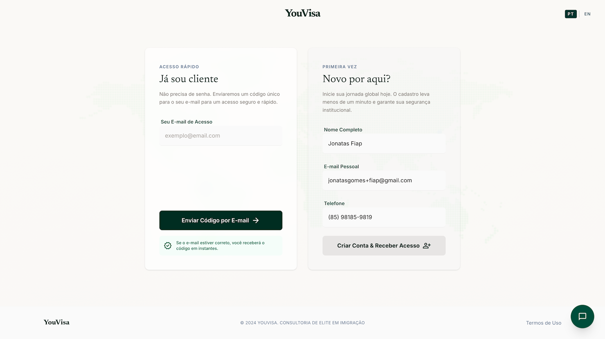  <br/>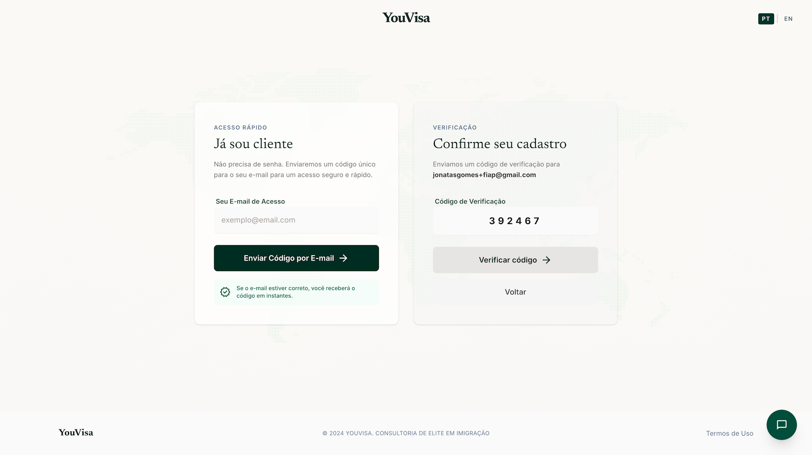  <br/>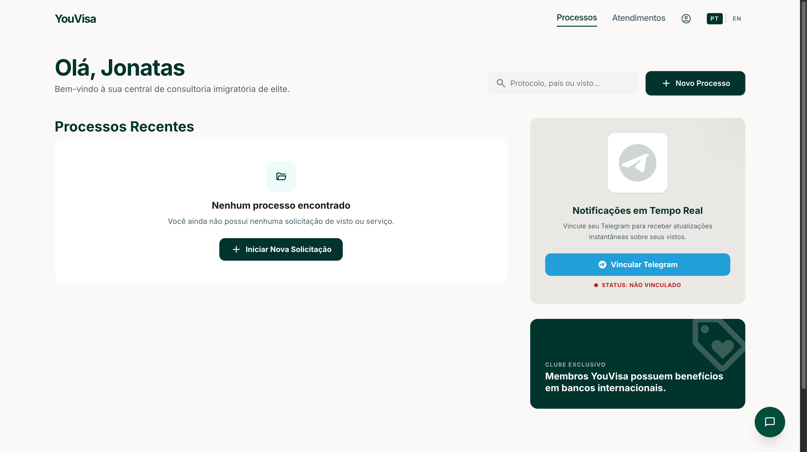

- Abertura de um processo, sendo possível gerar um upload estruturado de itens essenciais:
  <br/>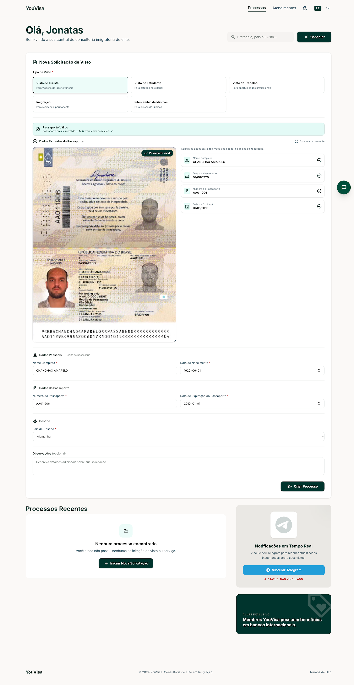  <br/>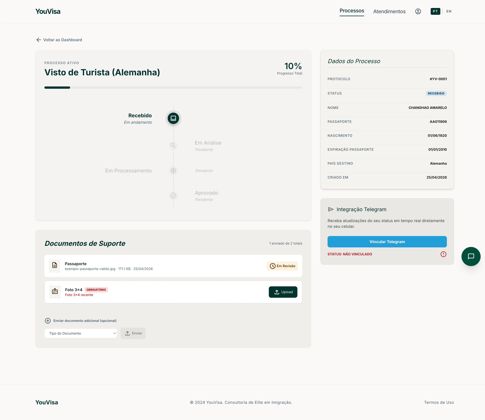


### O Poder Operacional do Admin e Uso de IA
- O admin tem uma central de operações onde visualiza, atualiza e aprova documentos e status (Machine states):
  <br/>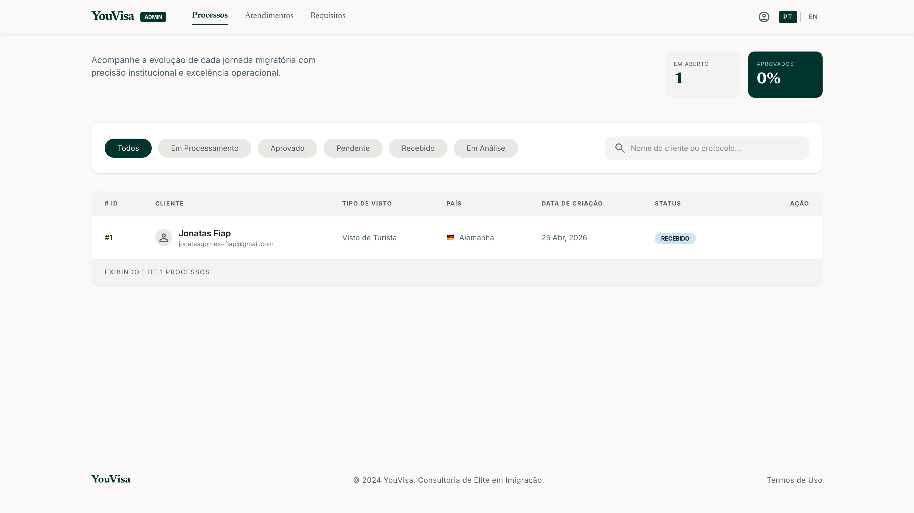

- Em destaque o **Aprovar com IA**. Em um clique, o Amazon Textract extrai dados do passaporte visualizando sua integridade.
  <br/>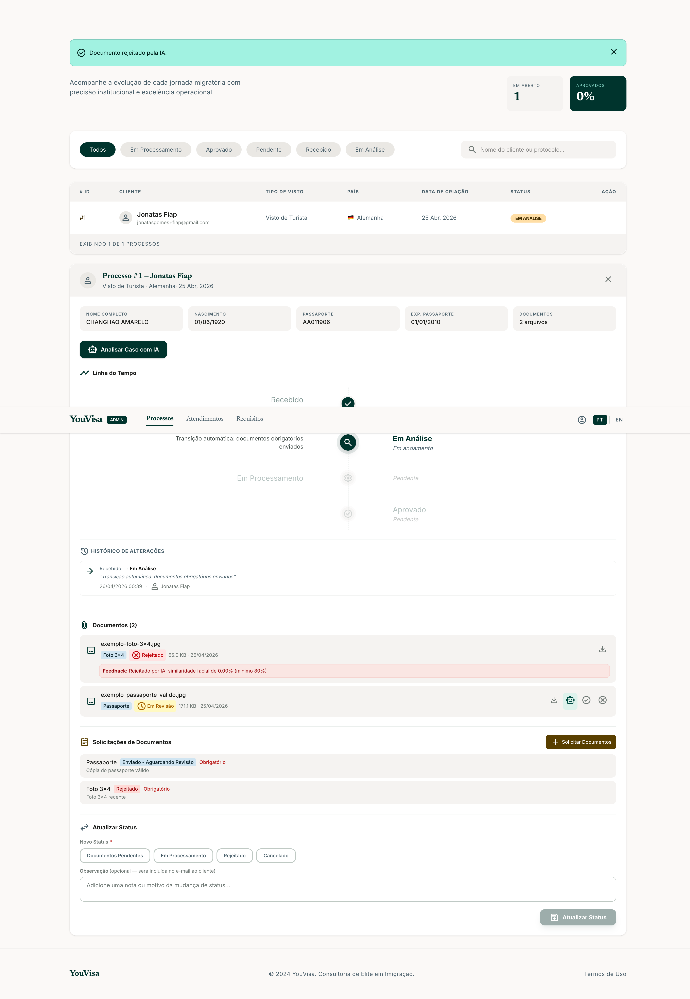
- Simultaneamente pode validar identidades, comparando a foto submetida versus aquela capturada no passaporte com o AWS Rekognition.
  <br/>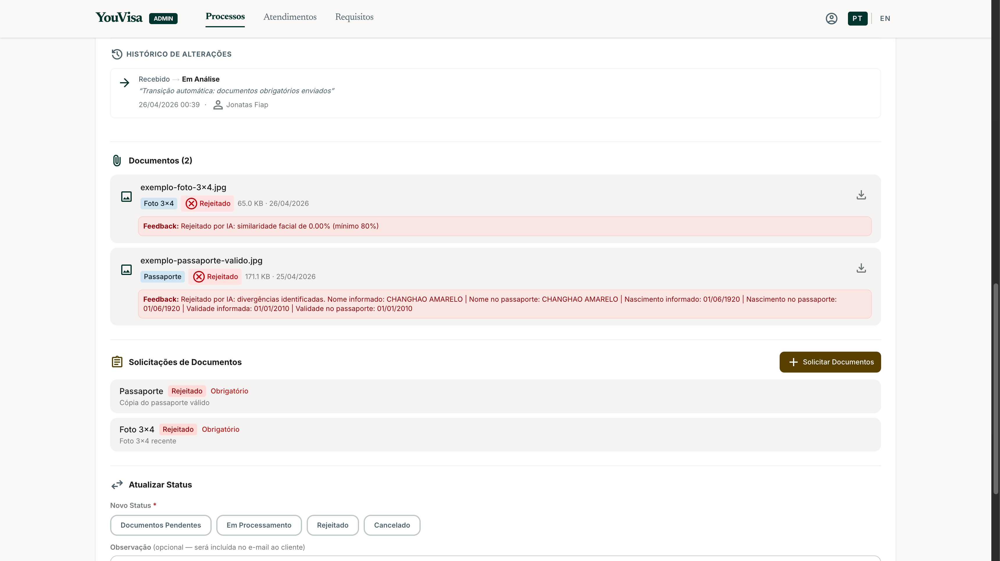
- Analisar Caso com IA — a joia da coroa do YouVisa: um copiloto que orquestra Textract, Rekognition e regras de negócio para entregar, em segundos, um diagnóstico completo de prontidão do processo de visto.
  <br/>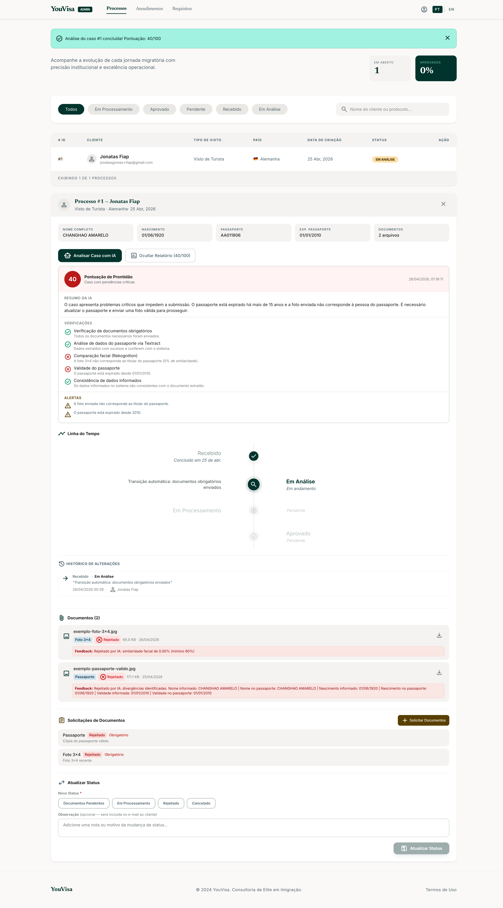


### Comunicações e Atendimento Automatizado
- Mudanças sistêmicas disparam **E-mails HTML interativos** detalhando a alteração efetuada nos processos e eventuais correções (arquitetura Event-Driven):
  <br/>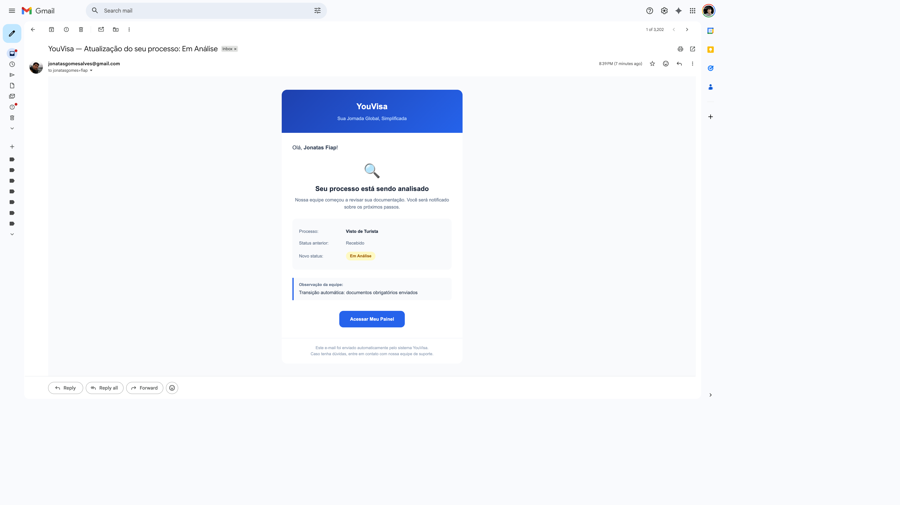
  <br/>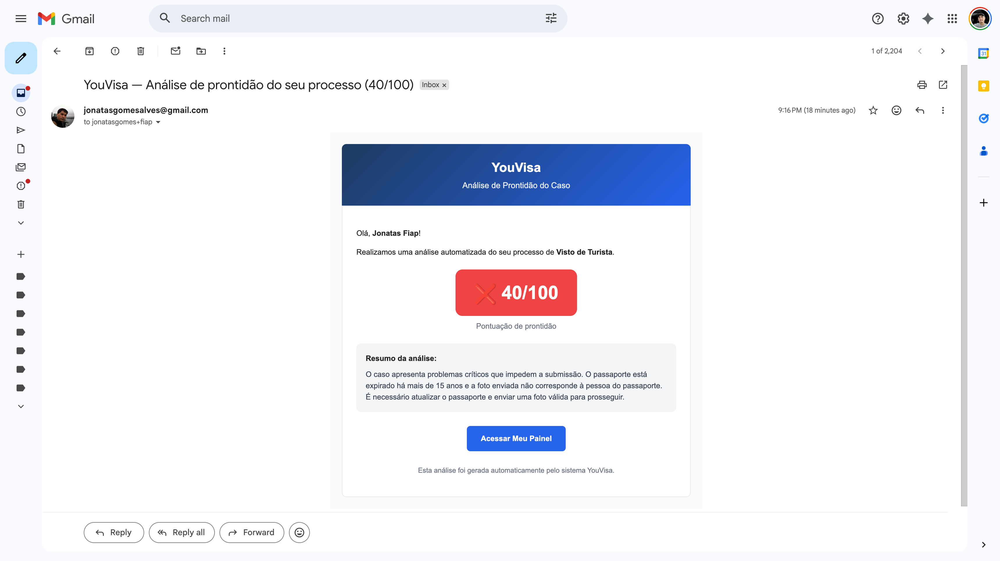

- O Chatbot entra ajudando pessoas sem login em conversas diárias. Ao solicitar processos, exige o login seguro por OTP:
  <br/>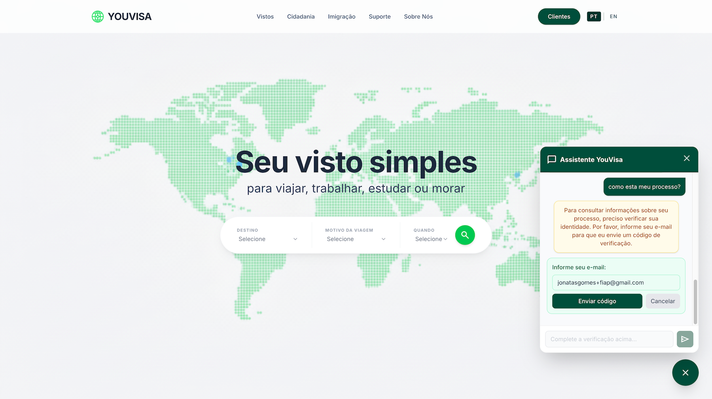
  <br/>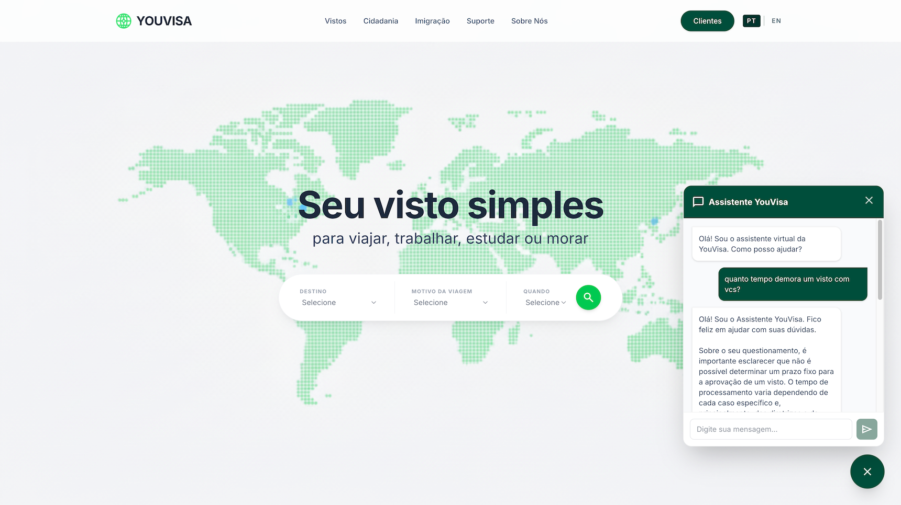

- Integração com Telegram — o YouVisa no bolso do cliente: basta escanear o QR code do dashboard para vincular a conta e, a partir daí, consultar status do processo, receber notificações em tempo real, conversar com o agente de IA, enviar documentos por foto e até falar diretamente com um atendente humano — tudo pelo aplicativo que ele já usa todos os dias.
  <br/>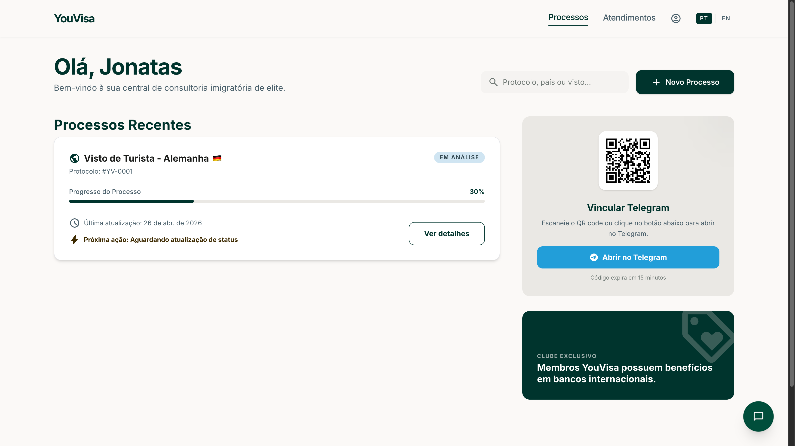
  <br/>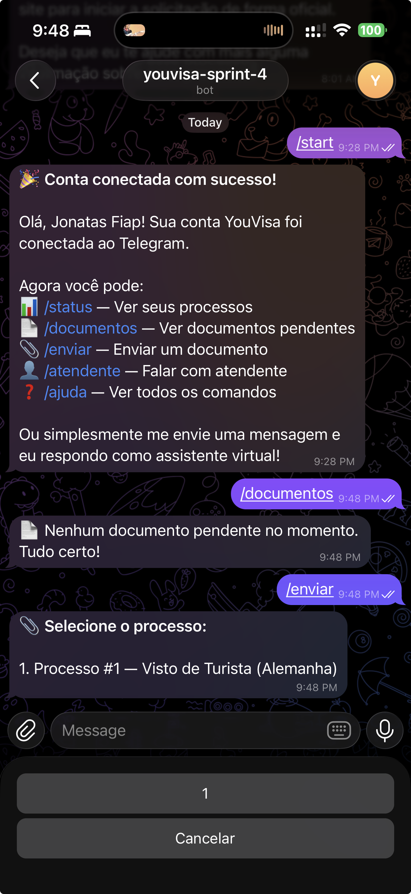
  <br/>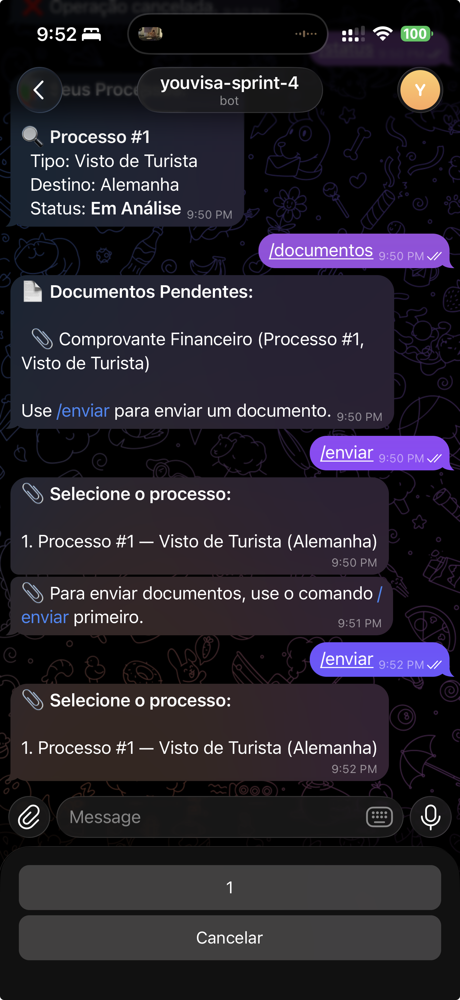

- Atendimento humano sob demanda — quando a IA não basta, o cliente fala com gente: um clique abre um chat bidirecional em tempo real entre usuário e equipe YouVisa, acessível tanto pelo dashboard quanto pelo Telegram, com histórico preservado e transição transparente entre bot e atendente.
  <br/>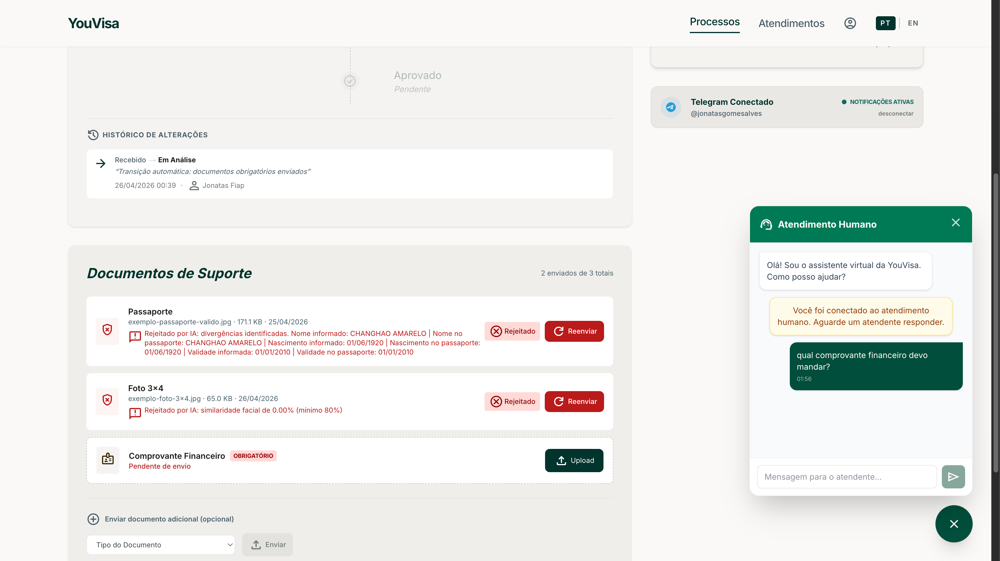
  <br/>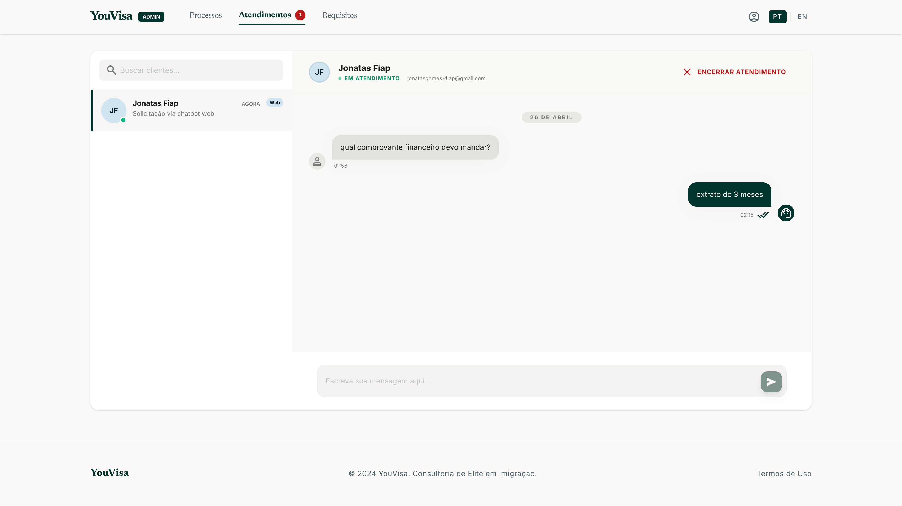

---

## **🛠️ TECNOLOGIAS UTILIZADAS**

 **Frontend:**
- [Next.js 15 (App Router)](https://nextjs.org/) + React 19
- Tailwind CSS v4 + TypeScript

 **Backend & Serviços:**
- Python 3.12 + FastAPI
- Oracle Autonomous Database (oracledb thin)
- Telegram Bot API (atendimento dual-channel)
- Autenticação local JWT

 **Inteligência Artificial & Nuvem:**
- [Google Gemini API](https://ai.google.dev/) (Integração NLP e Conversação)
- [AWS Textract](https://aws.amazon.com/pt/textract/) (Leitura e OCR Semântico)
- [AWS Rekognition](https://aws.amazon.com/pt/rekognition/) (Visão Computacional - Identity)

---

## **COMO EXECUTAR O PROJETO MÚLTIPLAS PASTAS**

O projeto é particionado em Frontend (Next.js) e Backend (FastAPI). Ambas as etapas precisam rodar.

### 1. Configurando e Rodando o Backend (FastAPI)
```bash
# 1. Entre na pasta backend pelo terminal
cd backend

# 2. Crie e ative um ambiente virtual 
python -m venv venv
# No mac/linux: source venv/bin/activate 
# No Windows: venv\Scripts\activate

# 3. Instale as dependências
pip install -r requirements.txt

# 4. Configure o arquivo de variáveis .env
# Necessário definir chaves do banco (DATABASE_URL), AWS (Textract/Rekognition), SMTP e Gemini (GEMINI_API_KEY).
# Siga a padronização exibida dentro do backend/CLAUDE.md

# 5. Execute o servidor de backend que responderá na porta 8000
python3 -m uvicorn main:app --reload
```

### 2. Rodando o Bot do Telegram
```bash
# 1. Entre na pasta backend pelo terminal
cd backend

# 2. Execute o bot do Telegram
python telegram_bot.py
```

### 3. Configurando e Rodando o Frontend (Next.js)
```bash
# 1. Em outra aba de seu terminal, vá a pasta do app React
cd frontend

# 2. Instale as dependências Node
npm install

# 3. Configure a porta para a API
# O único env vital neste caso e apontar NEXT_PUBLIC_API_URL=http://localhost:8000
# Para a IA flutuante não falhar verifique estar com o Gemini API Keys também por lá, caso requisitado.

# 4. Inicie o sistema
npm run dev

# Abra http://localhost:3000 em seu navegador
```
